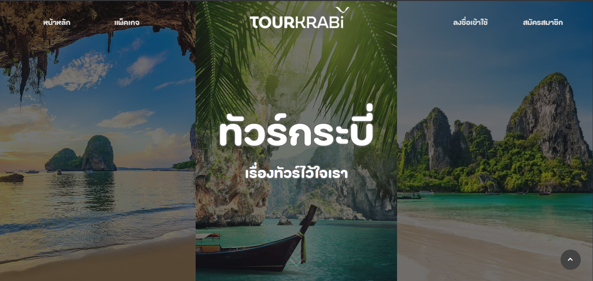

# 🏝️ TourKrabi

**TourKrabi** คือเว็บไซต์สำหรับจองทัวร์ท่องเที่ยวในจังหวัดกระบี่  
พัฒนาโดยใช้ **React TypeScript** สำหรับ Frontend และ **Strapi** สำหรับ Backend

---

## ✨ Features

### 👤 สำหรับลูกค้า

- 🔐 ระบบลงทะเบียน (Register) และเข้าสู่ระบบ (Login)
- 🧭 เลือกจองทัวร์แบบ **One Day Trip**
- 🏨 เลือกจองทัวร์แบบ **Package (ทัวร์ + ที่พัก)**
- 💳 ระบบการชำระเงิน (*Demo*)
- 🔁 จัดการการจอง (อัปเดต/ยกเลิก)

### 🛠️ สำหรับผู้จัดการระบบ

- ➕ เพิ่มทัวร์ใหม่
- 📝 แก้ไขรายละเอียดทัวร์และข้อมูลอื่น ๆ
- 👥 จัดการผู้ใช้งานในระบบ

---

## 🖼️ หน้าตาเว็บไซต์

---

## 📄 เอกสารประกอบ

- [📘 รายงานโปรเจกต์ (PDF)](./assets/docs/RS_DOC.pdf)
- [🧪 Test Case (PDF)](./assets/docs/Test_Case.pdf)
- [📊 Test Report (PDF)](./assets/docs/Test_Report.pdf)
- [👨‍💻 คู่มือการใช้งาน (User Manual)](./assets/docs/User_Manual_Document.pdf)

---